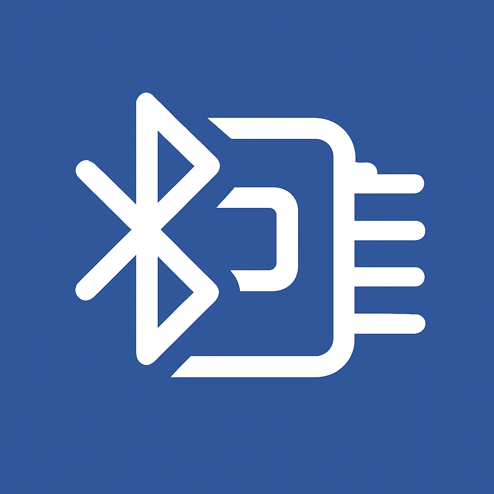

# 📡 BT24 Manager

### Εργαλείο διαχείρισης ονόματος BT-24 Bluetooth module μέσω του ρομπότ R2

---

## ✨ Τι είναι το BT24 Manager;

Το **BT24 Manager** είναι μια desktop εφαρμογή με γραφικό περιβάλλον που επιτρέπει την **ανάγνωση** και **αλλαγή** του ονόματος σε Bluetooth modules τύπου **BT-24**, τοποθετημένο επάνω στο ρομπότ R2 της Polytech.

Η εφαρμογή φροντίζει πρώτα να ανεβάσει αυτόματα το κατάλληλο **firmware** στο ρομπότ, ώστε ο χρήστης να μη χρειάζεται να ασχοληθεί καθόλου με το Arduino IDE — απλά συνδέεται με το ρομπότ και δουλεύει.

## 🚀 Χαρακτηριστικά

- 🔌 **Auto-detect σειριακών θυρών** με ζωντανή ανανέωση σε σύνδεση/αποσύνδεση
- 🛰️ **Αυτόματος έλεγχος & upload firmware** στο Arduino πριν από κάθε χρήση
- 👁️ **Ανάγνωση** του τρέχοντος ονόματος του Bluetooth module
- ✏️ **Αλλαγή ονόματος** με αυτόματο reset & επαλήθευση επιτυχίας
- 🎨 **Dark Theme UI** Σκούρο, μοντέρνο γραφικό περιβάλλον
- 🧭 **Καθοδήγηση βήμα-βήμα** στα ελληνικά, με μηνύματα κατάστασης, σφαλμάτων και προόδου
- 🖥️ **Cross-platform**: τρέχει σε Windows (.exe) και Linux, χωρίς εγκατάσταση (single-file executable)

## 📖 Χρήση

1. Σύνδεσε το Arduino (με τοποθετημένο το BT module) μέσω USB
2. Άνοιξε το **BT24 Manager**, επίλεξε το COM port 
3. Βεβαιώσου ότι ο διακόπτης BT είναι στη θέση **OFF** και πάτα **🔌 Σύνδεση**
4. Περίμενε τον αυτόματο έλεγχο/ενημέρωση firmware (αν χρειάζεται)
5. Επίλεξε **👁️ Εμφάνιση Ονόματος** ή **✏️ Αλλαγή Ονόματος**
6. Ακολούθησε τις οδηγίες στην οθόνη (θέση διακόπτη BT: ON/OFF)

## 👤 Author

**Vagelis Mihas**  
Electrical and Computer Engineer, NTUA | M.Sc. | Primary School CS Educator  
📧 [vmihas@sch.gr](mailto:vmihas@sch.gr)

## ⚖️ License

Η εφαρμογή διατίθεται δωρεάν υπό την άδεια **[CC BY-NC-ND 4.0](https://creativecommons.org/licenses/by-nc-nd/4.0/)** (Attribution-NonCommercial-NoDerivatives).

Μπορεί να χρησιμοποιηθεί και να μοιραστεί ελεύθερα, με τους όρους:

- 📛 **Αναφορά (BY)** — να αναφέρεται ο δημιουργός.
- 🚫 **Μη εμπορική χρήση (NC)** — όχι πώληση ή εμπορική εκμετάλλευση.
- 🔒 **Χωρίς παράγωγα έργα (ND)** — δεν επιτρέπεται τροποποίηση ή αναδιανομή τροποποιημένης έκδοσης.

## ⭐ Support

Για προτάσεις, bugs και νέα χαρακτηριστικά:  
➡️ Άνοιξε issue στη σελίδα του GitHub repository, ή στείλε email στο [vmihas@sch.gr](mailto:vmihas@sch.gr)

## 📦 Latest Releases

Κατεβάστε την εφαρμογή από την ενότητα **Releases** του GitHub.
